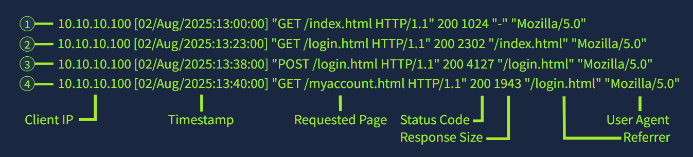
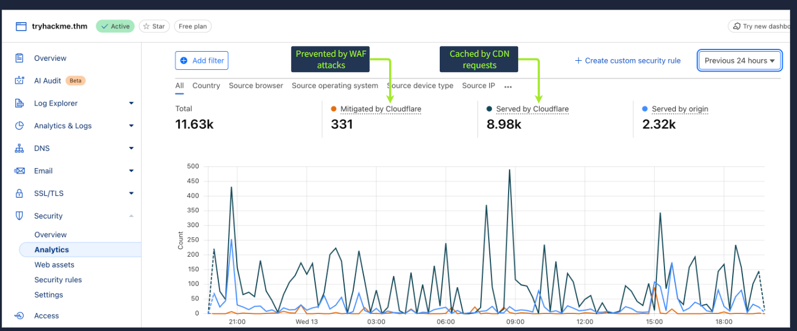
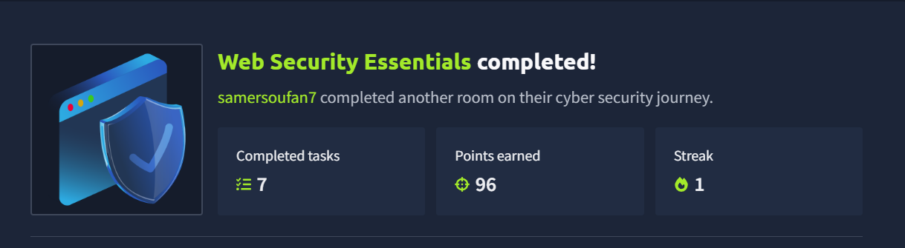

# 🔐 Web Security Essentials

**Author:** Nada Samer
**Role / Focus:** Cybersecurity | Web Security Fundamentals
**Platform:** TryHackMe

## 📌 Overview

This project documents a practical introduction to web security fundamentals through the **Web Security Essentials** room on TryHackMe.

The project explores how modern web applications work, why they are common targets for attackers, and the security controls used to protect web applications, web servers, and host machines.

Key topics covered include web infrastructure, HTTP request and response concepts, web server security, access logs, Web Application Firewalls (WAF), Content Delivery Networks (CDN), antivirus protection, patch management, and defensive security practices.

---

## 🎯 Learning Objectives

* Understand the transition from desktop applications to web applications.
* Understand the main components of a web service.
* Identify common web security risks.
* Learn defensive measures for applications, web servers, and host machines.
* Understand the role of web access logs in security monitoring.
* Understand how CDNs and WAFs help protect web applications.
* Explore common WAF detection techniques.
* Understand the importance of patch management and system hardening.

---

## 🌐 Web Service Architecture

A typical web service consists of three main components:

### 1. Application

The code, images, styles, and functionality that make up the web application.

### 2. Web Server

The server responsible for receiving HTTP requests and returning responses.

Examples include:

* Apache
* Nginx
* Microsoft IIS

### 3. Host Machine

The underlying operating system and environment running the web server and application.

---

## 🛡️ Security Controls

The room covered security measures across the three main components of a web service.

### Application Security

* Secure coding
* Input validation and sanitization
* Access control
* Secure error handling

### Web Server Security

* Access logging
* Web Application Firewall (WAF)
* Content Delivery Network (CDN)

### Host Security

* Least privilege
* System hardening
* Antivirus protection
* Patch management

---

## 📊 Web Access Logs

Web access logs provide valuable security information about requests received by a web server.

Important log fields include:

* Client IP address
* Timestamp
* Requested page or resource
* HTTP method
* Status code
* Response size
* Referrer
* User Agent

These records can help security analysts understand normal activity and reconstruct suspicious sequences of events during investigations.

### Evidence



---

## 🧱 Web Application Firewall (WAF)

A WAF provides an additional security layer for web applications by inspecting incoming HTTP traffic.

Common WAF deployment types include:

* **Cloud-based / Reverse Proxy**
* **Host-based**
* **Network-based**

### WAF Detection Techniques

The room covered several detection approaches:

* Signature-based detection
* Heuristic-based detection
* Anomaly and behavioral analysis
* Location and IP reputation filtering

**Signature-based detection** identifies requests that match known malicious patterns.

---

## ☁️ Content Delivery Network (CDN)

CDNs distribute cached content through geographically distributed edge servers.

From a security perspective, CDNs can provide:

* Origin IP masking
* DDoS protection
* HTTPS enforcement
* Integrated WAF capabilities

This can reduce direct exposure of the origin server while improving availability and performance.

### Evidence



---

## 🔧 Defensive Security Practices

Several defensive practices were covered throughout the room:

| Security Practice     | Purpose                                       |
| --------------------- | --------------------------------------------- |
| Input Validation      | Reduce malicious or unexpected input          |
| Access Control        | Restrict access based on user roles           |
| Logging               | Provide visibility into web activity          |
| WAF                   | Detect and block harmful HTTP requests        |
| CDN                   | Reduce direct exposure and improve resilience |
| Least Privilege       | Limit permissions available to services       |
| System Hardening      | Reduce unnecessary attack surface             |
| Patch Management      | Keep software and components up to date       |
| Strong Authentication | Prevent unauthorized access                   |

---

## 🧠 Key Takeaways

This project provided a foundation for understanding how web applications are structured and how multiple security controls work together.

The main concepts covered were:

* Web application architecture
* Web servers
* HTTP requests and responses
* Security logging
* WAF protection
* CDN security benefits
* Defensive security controls
* Patch management
* System hardening
* Defense-in-depth

---
## 🧠 Key Takeaways

...

## ✅ TryHackMe Completion

Completed the **Web Security Essentials** room on TryHackMe.



## 🧪 Platform & Training

**TryHackMe — Web Security Essentials**

This project was completed as part of practical cybersecurity training on TryHackMe.

---

## 📁 Project Structure

```text
Web-Security-Essentials/
├── README.md
├── screenshots/
│   ├── web-access-logs.png
│   ├── cloudflare-waf-cdn.png
│   └── tryhackme-completion.png
└── notes/
    └── security-controls.md
```

---

## 📚 Skills Demonstrated

* Web Security Fundamentals
* Web Application Security Concepts
* Security Controls
* Web Access Log Analysis Concepts
* WAF Concepts
* CDN Security
* Defensive Security
* Security Monitoring Concepts
* Patch Management
* System Hardening
* Cybersecurity Documentation
